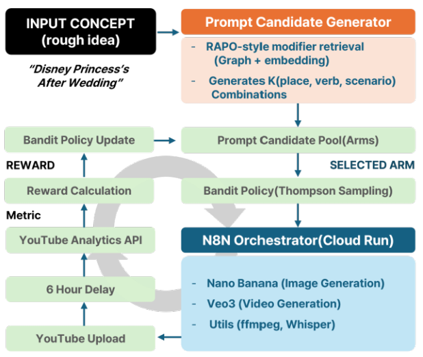

# HFBPO: Human-Feedback-Driven Bandit Prompt Optimization

> **Automatic Prompt Optimization for AI-Generated Video Content using Multi-Armed Bandit**

[](https://www.python.org/)
[](https://fastapi.tiangolo.com/)
[](LICENSE)

## Overview

HFBPO is an **automatic prompt optimization system** for Text-to-Video models. Users simply input a topic, and the system learns from YouTube viewer feedback to automatically discover the **most effective prompt combinations**.

### Core Idea

```
"Disney Princess After Wedding" (Topic Input)
        ↓
[RAPO Retrieval] Search place, verb, scenario candidates
        ↓
[Thompson Sampling] Select optimal combination
        ↓
[GPT Rewriting] Generate natural language prompt
        ↓
[Text-to-Video] Generate video → Upload to YouTube
        ↓
[After 6 hours] Collect YouTube Analytics → Calculate reward
        ↓
[Bandit Update] Update α, β parameters
        ↓
Repeat → Progressively learn better prompts
```

## Features

| Feature | Description |
|---------|-------------|
| **Modifier Retrieval** | Graph + embedding based retrieval for place, verb, scenario candidates |
| **Thompson Sampling** | Multi-Armed Bandit algorithm for exploration-exploitation balance |
| **GPT Rewriting** | Transform selected combinations into natural video prompts |
| **YouTube Analytics** | Collect views, CTR, retention, likes, comment sentiment |
| **Reward Calculation** | Normalize multiple metrics to scalar reward [0, 1] |
| **Auto Feedback Loop** | Automated feedback loop via n8n workflow |

## System Architecture



*Figure 1: RAPO-based candidate generation, Multi-Armed Bandit (Thompson Sampling), n8n workflow, YouTube Analytics feedback loop*

### Offline & Online Pipeline


*Figure 2: Detailed offline (graph embedding construction) and online (MAB selection) pipeline*

**Offline Phase:**
- Setup topics → Expand with GPT → Extract modifiers (place, verb, scenario)
- Build graph embeddings for co-occurrence relationships

**Online Phase:**
- Input topic → Embed → Retrieve top-k places → Extract graph neighbors
- Build K prompt candidates → Thompson Sampling → GPT Rewriting → Post to n8n

## Quick Start

### 1. Setup Environment

```bash
# Clone repository
git clone https://github.com/your-repo/HFBPO.git
cd HFBPO

# Create virtual environment
python -m venv venv
source venv/bin/activate  # Windows: venv\Scripts\activate

# Install dependencies
pip install -r requirements.txt
```

### 2. Configure Environment Variables

Create `.env` file:

```env
# OpenAI API (Embedding & GPT)
OPENAI_API_KEY=sk-xxx

# Fixed Topic (optional)
FIXED_TOPIC=Disney Princess Daily Life

# n8n Webhook URL
N8N_WEBHOOK_URL=https://your-n8n.cloud/webhook/video-trigger

# Google Sheets (for feedback loop)
GOOGLE_SHEETS_CREDENTIALS=credentials.json
GOOGLE_SHEET_ID=your-sheet-id

# YouTube Analytics API
YOUTUBE_API_KEY=your-youtube-api-key
```

### 3. Run

```bash
# CLI mode
python main.py

# API server mode
python api.py
# or
uvicorn api:app --reload --port 8000
```

## API Endpoints

| Method | Endpoint | Description |
|--------|----------|-------------|
| `GET` | `/` | Service info |
| `POST` | `/generate` | Generate prompt (+ send to n8n) |
| `POST` | `/reward` | Manual reward feedback |
| `POST` | `/update-policy` | Auto feedback loop execution |
| `GET` | `/arms` | Get ARM list |
| `GET` | `/stats` | Get bandit statistics |

### Example: Generate Prompt

```bash
curl -X POST "http://localhost:8000/generate" \
  -H "Content-Type: application/json" \
  -d '{"topic": "Han River Night View", "send_to_n8n": true}'
```

Response:
```json
{
  "prompt": "A serene evening at Han River park, drone shot slowly revealing the glittering city skyline...",
  "combination_key": "han river park|drone shot|serene",
  "place": "han river park",
  "verb": "drone shot",
  "scenario": "serene",
  "estimated_reward": 0.723,
  "candidates_count": 75,
  "n8n_sent": true
}
```

## Tech Stack

| Category | Technology |
|----------|------------|
| **Language** | Python 3.10+ |
| **Web Framework** | FastAPI |
| **ML/DL** | NumPy, PyTorch, Transformers |
| **Graph** | NetworkX |
| **Embedding** | OpenAI text-embedding-3-small |
| **LLM** | GPT-4o-mini |
| **Automation** | n8n |
| **Video Generation** | VEO3 (Google) |

## Modifier Graph Statistics

| Category | Count |
|----------|-------|
| Places | 153 |
| Verbs | 62 |
| Scenarios | 81 |
| Place-Verb Edges | 333 |
| Place-Scenario Edges | 358 |

## Reward Calculation

```
R = w₁·CTR + w₂·Retention + w₃·Engagement + w₄·Sentiment + w₅·Subscribers

Default weights:
- w₁ (CTR): 0.2
- w₂ (Retention): 0.4  ← Most important
- w₃ (Engagement): 0.2
- w₄ (Sentiment): 0.1
- w₅ (Subscribers): 0.1
```

## Thompson Sampling Algorithm

```python
# Maintain Beta distribution for each arm
for arm in candidate_arms:
    sampled_value = np.random.beta(arm.alpha, arm.beta)

# Select arm with highest sampled value
selected_arm = argmax(sampled_values)

# Update parameters after observing reward
arm.alpha += reward        # Accumulate success
arm.beta += (1 - reward)   # Accumulate failure
```

## Experiment Results

| Algorithm | Cumulative Reward | Regret | Optimal Rate |
|-----------|-------------------|--------|--------------|
| **Thompson Sampling** | **387.8 ± 12.3** | **37.2** | **66.8%** |
| ε-greedy (ε=0.1) | 364.2 ± 14.2 | 60.8 | 64.7% |
| UCB (c=2.0) | 309.8 ± 9.2 | 115.2 | 23.2% |
| Random | 269.6 ± 8.8 | 155.4 | 9.8% |

*Simulation: K=10 arms, T=500 episodes, 5 seeds*

## References

1. Agrawal, S., & Goyal, N. (2012). Analysis of Thompson Sampling for the Multi-armed Bandit Problem. *COLT*.
2. Gao, B. et al. (2021). RAPO: Retrieval-Augmented Prompt Optimization for Text-to-Video Generation. *CVPR*.

## License

MIT License
